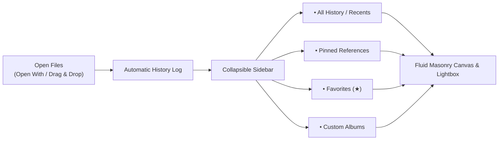

# Purview: Personal Desktop Gallery
### Product Design & Requirements Specification

---

## 1. Product Vision

**Purview** is a fast, minimalist desktop gallery for your computer. It serves as your personal visual memory: whenever you open images or drag them in, Purview automatically keeps a persistent history of everything you've viewed, allowing you to easily organize your collection with **Pinned References**, **Favorites**, and custom **Albums** in a fluid masonry grid.

### Core Principles
- **Automatic History**: You never have to manually "save" or worry about losing what you opened. Purview remembers your viewing history across sessions.
- **Fast & Minimalist**: No clutter or unnecessary complexity. Focused strictly on browsing, pinning, favoriting, and organizing albums.
- **Fluid Masonry Canvas**: Preserves true image aspect ratios with responsive multi-column scaling.

---

## 2. Core User Experience & Workflows



### Workflow 1: Opening & Viewing History
- When you open an image via *Right-Click -> Open With -> Purview* or drag files onto the window, Purview immediately displays them and records them in your **History / Recents**.
- Re-opening Purview later restores your full gallery history so you can pick up where you left off.

### Workflow 2: Favoriting & Pinning
- **Favorite (★)**: Click the star icon on any image to mark it as a favorite. Access all favorites instantly from the sidebar.
- **Pin (📌)**: Pin important images to the top of your current view for immediate reference.

### Workflow 3: Creating & Managing Albums
- Click **`+ New Album`** in the sidebar to create dedicated collections (e.g. *Moodboard*, *Architecture*, *Photography*, *Project Assets*).
- Assign images to one or more albums and easily switch between albums from the sidebar.

---

## 3. Detailed Feature Requirements

### 3.1. Automatic History & Persistence
- **Session Memory**: All opened files are persistently saved in a lightweight local library index.
- **Deduplication**: Opening a previously viewed image updates its recent timestamp rather than duplicating it.
- **Clear History Option**: Allows users to clear recent viewing history if desired.

### 3.2. Navigation Sidebar (Collapsible)
A sleek, modern left sidebar with direct access to:
- **⏱ All / History**: Full chronological viewing history of all opened images.
- **📌 Pinned**: Dedicated view of all currently pinned images.
- **★ Favorites**: Dedicated view of starred / favorited assets.
- **📁 Albums**:
  - List of user-created albums.
  - **`+ New Album`** button to create a new collection with a custom name.
  - Ability to rename or delete albums.
  - Badge showing image count for each album.
- **Toggle Button**: Quickly expand or collapse the sidebar for full-width gallery browsing.

### 3.3. Canvas & Image Actions
- **Fluid Masonry Grid**: Dynamic column scaling (1 to 12 columns) via slider or scroll wheel.
- **Card Micro-Actions**:
  - **Pin (📌)**: Snap to top of the grid.
  - **Favorite (★)**: Toggle favorite status.
  - **Add to Album**: Assign to a specific album.
  - **Expand / Preview (⛶)**: Open full-resolution lightbox.
  - **Remove**: Remove from current album or library.

### 3.4. Lightbox Preview Modal
- Click any image to view full-resolution in a dark studio modal.
- On-screen and keyboard navigation (`←` / `→` arrow keys, `Esc` to close).
- Quick Favorite (★) and Pin (📌) toggles inside the preview.

---

## 4. User Interface Layout

```
+---------------------------------------------------------------------------------------+
| 🔴 🟡 🟢   [ Sidebar ◨ ]   PURVIEW   •  All History (24)        [ − ❚❚❚❚❚ + ]  [Select] |
+-------------------+-------------------------------------------------------------------+
|  LIBRARY          |  PINNED REFERENCES (2)                                            |
|  ⏱ All History    |  [ Image Card ]  [ Image Card ]                                   |
|  📌 Pinned        |  ---------------------------------------------------------------- |
|  ★ Favorites      |  GALLERY (22)                                                     |
|                   |  [ Image Card ]  [ Image Card ]  [ Image Card ]  [ Image Card ]   |
|  ALBUMS  [+]      |  [ Image Card ]  [ Image Card ]  [ Image Card ]  [ Image Card ]   |
|  📁 Architecture  |  [ Image Card ]  [ Image Card ]  [ Image Card ]  [ Image Card ]   |
|  📁 Typography    |                                                                   |
|  📁 Moodboards    |                                                                   |
+-------------------+-------------------------------------------------------------------+
```

---

## 5. Summary of Scope

| In Scope (Core Focus) | Out of Scope (Deferred) |
| :--- | :--- |
| Persistent Viewing History & Recents | Cloud Sync & Accounts |
| Collapsible Navigation Sidebar | Complex File Watching Daemons |
| Starred Favorites (★) | Automated Color Extraction Tools |
| Custom Albums (+ New Album, Add to Album) | Destructive File System Editing |
| Fluid Masonry Grid & Lightbox Preview | AI Tagging Engines |
