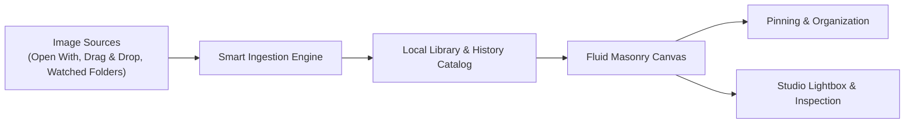

# Purview: Next-Generation Desktop Gallery & Visual Library
### Product Design & Requirements Specification

---

## 1. Product Vision & Core Philosophy

**Purview** is evolving from a temporary image viewer into a **fast, private, local-first image gallery and reference system** for macOS. 

Traditional desktop image viewers (like Apple Preview or default photo apps) are either too isolated (viewing one file at a time without context) or too bloated (requiring heavy cloud imports and sluggish database syncs). Purview combines the speed of a native utility with the organization and visual elegance of tools like **Pinterest, Eagle, and Apple Photos**.

### Design Principles
1. **Zero-Friction Ingestion**: Whenever you open an image via *Open With*, drag a folder into the window, or take a screenshot, Purview immediately presents it and remembers it in your history.
2. **Local-First & Private**: No cloud account required, no file duplication unless requested, blazing-fast local disk access.
3. **Fluid Visual Hierarchy**: Pinterest-style dynamic masonry layouts that preserve true image aspect ratios without ugly square crops.
4. **Persistent Memory**: Your gallery history, pinned references, and custom moodboards remain intact across app launches.

---

## 2. User Journey & Core Workflows



### Workflow A: Opening Single / Multiple Files from Finder
1. User right-clicks an image in Finder: `Open With -> Purview`.
2. Purview instantly displays the image in the current workspace.
3. The image is automatically indexed into **"Recent History"** with its file origin, timestamp, and metadata.

### Workflow B: The Auto-Cataloging Daily Driver
1. User works across Photoshop, Figma, web browsers, and screenshots.
2. User drops reference images directly into Purview throughout the week.
3. Purview organizes them into a continuous timeline: **Today**, **Yesterday**, **Previous 7 Days**, **This Month**.

### Workflow C: Folder Watching & Automatic Sync
1. User connects local folders (e.g., `~/Downloads`, `~/Screenshots`, `~/Projects/DesignRefs`).
2. Purview monitors file additions in the background without moving or duplicating original files on disk.
3. New files appear in the gallery automatically.

---

## 3. Core Feature Requirements

### 3.1. Automatic History & Library Persistence
- **Persistent Catalog**: The app remembers all opened images across sessions in a lightweight local index.
- **Timeline Organization**: Group items by date opened (`Today`, `Yesterday`, `Last Week`, `Older`).
- **Deduplication Engine**: Opening the same image multiple times highlights the existing entry instead of creating duplicates.
- **File Health Monitoring**: If a file is deleted or moved on disk, Purview displays a graceful missing-file indicator with an option to clean up or locate.

### 3.2. Navigation & Sidebar System
A modern, collapsible minimal sidebar for quick switching between library views:
- **Recents**: Complete chronological history of all images opened.
- **Pinned & Favorites**: Quick access to highest-priority reference materials.
- **Watched Folders**: Direct live browsing of system directories (e.g., Screenshots, Downloads).
- **Collections / Boards**: Custom virtual moodboards created by the user (e.g., *Project Aurora*, *Color Inspo*, *Typography Refs*).
- **Trash / Archive**: Safe removal from Purview history without deleting original files from disk unless explicitly requested.

### 3.3. Canvas & Layout Experience
- **Fluid Multi-Scale Masonry**: Continuous column scaling (1 to 12 columns) via slider or scroll wheel.
- **Section Grouping**: Visual separation between pinned priority references and general gallery items.
- **Batch Selection & Reordering**: Select multiple images for batch pinning, tagging, exporting, or removal.
- **Drag-and-Drop Reordering**: Rearrange image positions within custom boards.

### 3.4. Studio Lightbox & Inspector
- **Instant Fullscreen View**: Click any image or press `Space` to enter a cinematic lightbox.
- **Deep Zoom & Pan**: Smooth trackpad pinch-to-zoom and pan for high-resolution inspection.
- **Sidebar Info Panel**:
  - File Name, Format (PNG, JPEG, WebP, GIF, SVG, BMP)
  - Dimensions & Megapixels (e.g., `3840 × 2160 · 8.3 MP`)
  - File Size (`4.2 MB`)
  - Color Palette Extraction (Top 5 dominant hex colors with one-click copy)
  - Full File Path with "Show in Finder" action

---

## 4. User Interface Architecture

```
+-----------------------------------------------------------------------------------------+
|  🔴 🟡 🟢   PURVIEW    [ Recents ▼ ]          [ Search / Filter 🔍 ]   [ − ❚❚❚❚❚ + ]  [Select] |
+------------------+----------------------------------------------------------------------+
|  LIBRARY         |  PINNED REFERENCES (3)                                               |
|  ⏱ Recents       |  [ Image Card ]  [ Image Card ]  [ Image Card ]                      |
|  📌 Pinned       |  ------------------------------------------------------------------- |
|  ★ Favorites     |  TODAY (12 Assets)                                                   |
|                  |  [ Image Card ]  [ Image Card ]  [ Image Card ]  [ Image Card ]      |
|  FOLDERS         |  [ Image Card ]  [ Image Card ]  [ Image Card ]  [ Image Card ]      |
|  📁 Screenshots  |                                                                      |
|  📁 Downloads    |  YESTERDAY (8 Assets)                                                |
|                  |  [ Image Card ]  [ Image Card ]  [ Image Card ]  [ Image Card ]      |
|  BOARDS          |                                                                      |
|  📁 3D Renders   |                                                                      |
|  📁 Branding Ref |                                                                      |
+------------------+----------------------------------------------------------------------+
```

### Key UI Elements
1. **Unified Top Bar (48px)**:
   - Window drag area with macOS traffic light clearance.
   - Global search input (filters by filename, format, tag, or dominant color).
   - Dynamic scale stepper and column slider.
   - Batch selection mode toggle.
2. **Left Sidebar (Collapsible with `⌘ + B`)**:
   - Clean linear icons for library categories.
   - Drag target for dropping images directly into custom collections.
3. **Gallery Canvas**:
   - Lazy-loaded masonry layout designed for handling 10,000+ local assets with 60 FPS scrolling.
   - Micro-interaction badges for instant Pin, Expand, and Quick-Tag.
4. **Detail Inspector (Slide-over with `⌘ + I`)**:
   - Non-intrusive metadata drawer showing dimensions, color palette, and Finder shortcuts.

---

## 5. Non-Technical Quality Attributes

- **Performance**: Instant startup (< 200ms), buttery smooth 60 FPS scrolling through thousands of photos.
- **Simplicity**: No complex database configurations, accounts, or cloud logins.
- **Safety**: Purview references your files in place without destructive edits to your original photos.
- **macOS Native Aesthetics**: Adherence to Apple Human Interface Guidelines (SF Pro typography, translucent frosted acrylic materials, and system keybindings).

---

## 6. Phased Product Roadmap

| Phase | Milestone | Focus Areas |
| :--- | :--- | :--- |
| **Phase 1** | **History & Persistence** | Auto-saving opened files to a local database; Timeline groupings (`Today`, `Yesterday`, `Past Week`); Session restoration. |
| **Phase 2** | **Navigation & Folders** | Collapsible sidebar; Watched folders integration (`Screenshots`, `Downloads`); Show in Finder shortcuts. |
| **Phase 3** | **Inspector & Metadata** | Slide-over inspector panel; Dimensions & file size display; Dominant color palette generation. |
| **Phase 4** | **Boards & Smart Search** | Custom user moodboards; Fast text/format/color search; Batch operations. |
