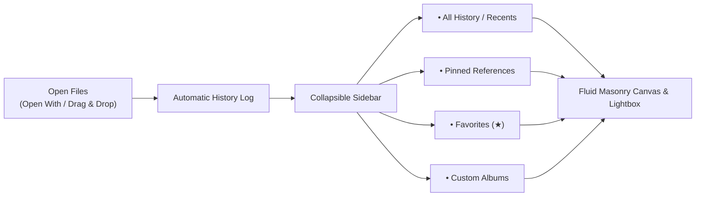

# Purview: Personal Desktop Gallery
### Product Design & Requirements Specification

---

## 1. Product Vision

**Purview** is a fast, minimalist desktop gallery for your computer. It serves as your personal visual memory: whenever you open images or drag them in, Purview automatically keeps a persistent history of everything you've viewed, allowing you to easily organize your collection with **Pinned References**, **Favorites**, custom **Albums**, and spatial **Boards** in a fluid masonry grid.

### Core Principles
- **Automatic History**: You never have to manually "save" or worry about losing what you opened. Purview remembers your viewing history across sessions.
- **Fast & Minimalist**: No clutter or unnecessary complexity. Focused strictly on browsing, pinning, favoriting, and organizing albums.
- **Fluid Masonry Canvas**: Preserves true image aspect ratios with responsive multi-column scaling.

---

## 2. Core User Experience & Workflows



### Workflow 1: Opening & Viewing History
- When you open an image via *Right-Click -> Open With -> Purview* or drag files onto the window, Purview immediately displays them and records them in your **History / Recents**.
- Re-opening Purview later restores your full gallery history so you can pick up where you left off.

### Workflow 2: Favoriting & Pinning
- **Favorite (★)**: Click the star icon on any image to mark it as a favorite. Access all favorites instantly from the sidebar.
- **Pin (📌)**: Pin important images to the top of your current view for immediate reference.

### Workflow 3: Creating & Managing Albums
- Click **`+ New Album`** in the sidebar to create dedicated collections (e.g. *Moodboard*, *Architecture*, *Photography*, *Project Assets*).
- Assign images to one or more albums and easily switch between albums from the sidebar.

---

## 3. Detailed Feature Requirements

### 3.1. Automatic History & Persistence
- **Session Memory**: All opened files are persistently saved in a lightweight local library index.
- **Deduplication**: Opening a previously viewed image updates its recent timestamp rather than duplicating it.
- **Clear History Option**: Allows users to clear recent viewing history if desired.

### 3.2. Navigation Sidebar (Collapsible)
A sleek, modern left sidebar with direct access to:
- **⏱ All / History**: Full chronological viewing history of all opened images.
- **📌 Pinned**: Dedicated view of all currently pinned images.
- **★ Favorites**: Dedicated view of starred / favorited assets.
- **📁 Albums**:
  - List of user-created albums.
  - **`+ New Album`** button to create a new collection with a custom name.
  - Ability to rename or delete albums.
  - Badge showing image count for each album.
- **Toggle Button**: Quickly expand or collapse the sidebar for full-width gallery browsing.

### 3.3. Canvas & Image Actions
- **Fluid Masonry Grid**: Dynamic column scaling (1 to 12 columns) via slider or scroll wheel.
- **Card Micro-Actions**:
  - **Pin (📌)**: Snap to top of the grid.
  - **Favorite (★)**: Toggle favorite status.
  - **Add to Album**: Assign to a specific album.
  - **Expand / Preview (⛶)**: Open full-resolution lightbox.
  - **Remove**: Remove from current album or library.

### 3.4. Lightbox Preview Modal
- Click any image to view full-resolution in a dark studio modal.
- On-screen and keyboard navigation (`←` / `→` arrow keys, `Esc` to close).
- Keep Favorite, Pin, Album, and Board actions available at the preview's top-right edge.
- Preview action buttons may change border, surface, and icon color on hover, but must not grow, shrink, shift, or use an expansion transition.
- Treat the complete Preview overlay and toolbar as a native non-drag region so macOS title-bar dragging never intercepts zoom, organization, or close controls.

### 3.5. Boards
- Add a first-class **Boards** destination under Library, presented as an album-like overview of locally persisted board cards.
- Each card uses a compact multi-image cover, image count, and direct rename/delete controls; creating a board opens it immediately.
- Opening a board expands it across the workspace as an optimized single-panel canvas that preserves mixed image aspect ratios and supports drag reordering.
- Add a dedicated board action to every gallery image. Its popover lets one image be added to or removed from any number of boards without moving the source file or changing album membership.
- Keep board navigation in the global top bar: an open board shows its name, image count, and a consistent back button to the Boards overview.
- Persist board names, membership, and manual order locally. Removing an image from a board must not delete it from the Purview library or disk.

### 3.6. Exact Duplicates
- Group exact binary image matches found across local folders while keeping only one image in the main gallery.
- Present duplicate groups as large, image-first masonry tiles that preserve each image's natural aspect ratio without cropping, stretching, or letterboxing.
- Show the number of copies directly on the image and keep folder locations collapsed into quiet metadata by default.
- Allow users to expand each group and reveal any individual copy in Finder.
- Provide independent 1–12 column scaling for the Duplicates masonry, including the same slider and scroll-to-resize interaction as History.
- Keep gallery-only selection actions out of the Duplicates view.

### 3.7. Characters
- Add a **Characters** collection that groups local photos by recurring visual identity.
- Run face detection, anime-specific CCIP identity embedding, pose-aware SFace verification, and clustering entirely on-device; images and embeddings must never leave the computer.
- Perform analysis in an isolated background service so browsing and image interaction remain responsive.
- Cache results by file fingerprint and model version, rescanning only new or changed local images.
- Present an overview of unnamed character groups using a representative face crop and the number of matching photos.
- Add a transparent second grouping layer: link strongly similar strict identity clusters through their closest neighboring variant, place the resulting family in one shared character section, keep the cluster variants visibly represented, and order sections from most matching photos to least.
- Present each section's representative faces as a left-to-right layered stack with controlled overlap, preserving most of every portrait while communicating that the variants belong to one family.
- Keep stacked portraits on one fixed horizontal baseline. Hovering a section changes only its border and surface color; the stack must not expand, shift, fan out, or animate spatially.
- Treat automatic analysis as the starting point, not an irreversible decision. Provide a dedicated **Organize** mode where every strict face variant becomes individually selectable without disturbing the normal stacked overview.
- Let users move one or several selected variants into another character section or extract them into a new section. Keep these corrective actions in a compact floating selection bar and use a searchable, image-backed destination picker so the user can visually verify the target.
- Store manual character assignments locally as an override layer over the automatic result. Reapply them after rescans and when new folders are imported, while leaving newly discovered uncorrected faces under automatic organization.
- Provide an explicit, confirmed **Reset automatic** action that removes manual overrides without deleting images or cached analysis.
- Place the Characters title, section count, Organize state, and Scan action in the global top bar.
- Opening a character group shows every original photo containing that identity in a natural-aspect masonry view with lightbox preview.
- Character-detail and duplicate-image surfaces use the same hover action set as History: Pin, Favorite, Board, Album, and Preview. Clicking the image body opens the same full preview.
- Prefer conservative separation over incorrect identity merges while tolerating rotation, perspective, and expression changes: compare candidates with a robust group representative, use graduated CCIP/SFace confidence bands so extremely close appearance matches survive unreliable profile scores, require majority support with a bounded outlier ratio, and reject ambiguous assignments. Run a guarded second pass so high-confidence views split by scan order can reunite. Uncertain or unusable faces remain separate.
- Do not infer names, age, gender, ethnicity, emotion, or other sensitive attributes.
- Support photographic and illustrated characters when they have a clear face; treat no-visible-face identity matching as a later experimental extension.

---

## 4. User Interface Layout

- Keep the global top bar compact and single-line. It may change its page-level actions and navigation controls for the current path, but must not add explanatory subtitle rows.
- When the user enters a deeper path, such as a character section or album, show a consistent back button in the global top bar and update its title and count for that destination. Do not repeat this navigation header inside the scrolling canvas.
- Duplicates, Characters, and Albums must not repeat their page title or count inside the scrolling canvas; those belong to the contextual top bar.
- Tab changes must render galleries immediately. Do not replay page fades, staggered card entrances, image fade-ins, or spatial reveal animation when switching collections.

```
+---------------------------------------------------------------------------------------+
| 🔴 🟡 🟢   [ Sidebar ◨ ]   PURVIEW   •  All History (24)        [ − ❚❚❚❚❚ + ]  [Select] |
+-------------------+-------------------------------------------------------------------+
|  LIBRARY          |  PINNED REFERENCES (2)                                            |
|  ⏱ All History    |  [ Image Card ]  [ Image Card ]                                   |
|  📌 Pinned        |  ---------------------------------------------------------------- |
|  ★ Favorites      |  GALLERY (22)                                                     |
|                   |  [ Image Card ]  [ Image Card ]  [ Image Card ]  [ Image Card ]   |
|  ALBUMS  [+]      |  [ Image Card ]  [ Image Card ]  [ Image Card ]  [ Image Card ]   |
|  📁 Architecture  |  [ Image Card ]  [ Image Card ]  [ Image Card ]  [ Image Card ]   |
|  📁 Typography    |                                                                   |
|  📁 Moodboards    |                                                                   |
+-------------------+-------------------------------------------------------------------+
```

---

## 5. Summary of Scope

| In Scope (Core Focus) | Out of Scope (Deferred) |
| :--- | :--- |
| Persistent Viewing History & Recents | Cloud Sync & Accounts |
| Collapsible Navigation Sidebar | Complex File Watching Daemons |
| Starred Favorites (★) | Automated Color Extraction Tools |
| Custom Albums (+ New Album, Add to Album) | Destructive File System Editing |
| Fluid Masonry Grid & Lightbox Preview | AI Tagging Engines |
